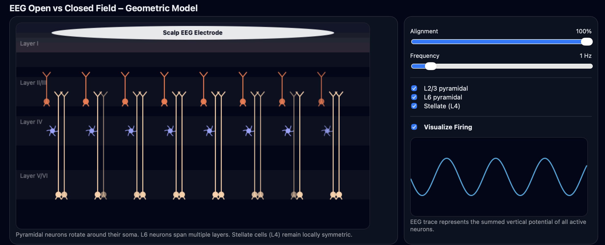

# EEG Open vs Closed Field – Geometric Model

An interactive, browser-based simulation designed to build an intuitive understanding of the biophysical origins of EEG signals. This tool visualizes how neuronal geometry and population alignment determine whether electrical fields summate to form a detectable signal at the scalp ("Open Field") or cancel out ("Closed Field").



## Run Demo at https://dbrang.github.io/Open-Closed-Fields-Demo/

## 🧠 About The Project

Electroencephalography (EEG) measures electrical activity from the scalp, but it cannot hear every neuron. Why do some active neurons generate strong EEG signals while others remain silent?

This simulation answers that question by modeling the cortex as a geometric system. It demonstrates that **synchrony is not enough**—geometry matters. For an EEG signal to be generated, neurons must be arranged in a parallel, laminar structure (an "Open Field").

### Key Concepts Demonstrated
* **Open Fields (Pyramidal Neurons):** The simulation shows Pyramidal neurons (Layers 2/3 and 6) acting as dipoles. When these neurons are spatially aligned, their electrical fields summate, creating a large vertical potential readable by the scalp electrode.
* **Closed Fields (Stellate Neurons):** The simulation depicts Layer 4 Stellate cells as radially symmetric. Because their dendrites radiate in all directions, their electrical fields cancel themselves out locally. Even when active, they contribute almost nothing to the macroscopic EEG trace.
* **The Importance of Alignment:** Users can manipulate the orientation of pyramidal cells. As alignment decreases (simulating curved gyri or disorganized tissue), the net EEG signal diminishes, even if the neurons are firing vigorously.

## ✨ Features

* **Real-time Visualization:** See a cross-section of the cortex with Layers I,II/III, IV, and V/VI.
* **Interactive Controls:**
    * **Alignment Slider:** Adjust the spatial orientation of pyramidal neurons from random (0%) to perfectly parallel (100%).
    * **Frequency Slider:** Change the firing rate (0.2 Hz to 10 Hz) to see how temporal dynamics affect the trace.
    * **Neuron Toggles:** Turn specific layers (L2/3, L6, Stellate) on or off to isolate their contribution to the signal.
    * **Visualize Firing:** Toggle the visual "flashing" of action potentials.
* **Simulated EEG Trace:** A scrolling canvas graph that calculates the summed vertical potential of all active neurons in real-time.
* **Zero Dependencies:** Built entirely in vanilla HTML5, CSS, and JavaScript. No libraries or frameworks required.

## 🚀 Quick Start

Since this project consists of a single HTML file with embedded logic, no build process is required.

1.  **Download** the `index.html` file.
2.  **Ensure** the image `Open_Closed_Fields.png` is in the same directory (optional, for README display).
3.  **Open** `index.html` in any modern web browser (Chrome, Firefox, Safari, Edge).
4.  **Interact** with the controls on the right panel to explore the model.

## 🔧 How It Works (Under the Hood)

The simulation uses an HTML5 Canvas loop to calculate the "net instantaneous potential" based on the angle of every neuron relative to the electrode.

* **Pyramidal Calculation:** The code calculates the cosine of the deviation angle for pyramidal neurons.
    ```javascript
    // Logic snippet
    let deviation = seed.angleOffset * (1 - alignVal);
    const verticalContribution = Math.cos(deviation);
    ```
    If `alignVal` is 100%, deviation is 0, and `verticalContribution` is 1 (max signal). If aligned randomly, the sum approaches zero due to cancellation.

* **Stellate Calculation:** Stellate cells are assigned a fixed, negligible contribution factor to simulate the physics of a closed field, regardless of alignment.

## 🤝 Contributing

Contributions are welcome! If you have ideas for improving the physics engine (e.g., adding Volume Conduction effects) or the visualization, feel free to fork the repo and submit a pull request.

## 📝 License

Distributed under the MIT License.
